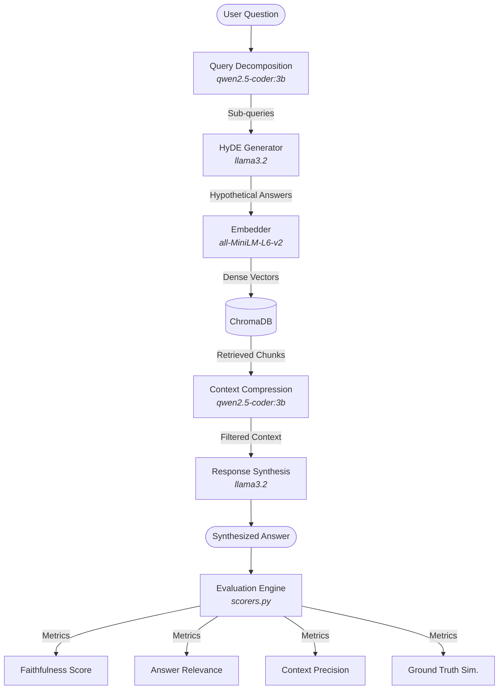

# Advanced-RAG-Toolkit

An advanced, production-grade Retrieval-Augmented Generation (RAG) system implementing state-of-the-art query expansion, retrieval enhancement, context compression, and comprehensive LLM-as-a-judge evaluations.

---

## Architecture Workflow

The pipeline utilizes **Query Decomposition**, **Hypothetical Document Embeddings (HyDE)**, **Context Compression (Sentence Filtering)**, and **Multi-Metric Evaluation**.



---

## Features

- **Query Decomposition**: Deconstructs complex queries into 2-4 granular sub-queries to ensure complete coverage.
- **Hypothetical Document Embeddings (HyDE)**: Generates hypothetical, factual documents for each sub-query to bridge the vocabulary gap during semantic search.
- **Context Compression**: Compresses retrieved passages sentence-by-sentence to extract only directly relevant info, keeping context windows clean.
- **Robust Evaluation Suite**: LLM-as-a-judge scorers for:
  - **Faithfulness**: Factuality of the generated answer against the context.
  - **Answer Relevance**: Embedding-based similarity between user query and answer.
  - **Context Precision**: The proportion of retrieved chunks that survive compression.
  - **Ground Truth Similarity**: Cosine similarity between the answer and gold-standard references.
- **CLI Interface**: Rich visual output, tables, and progress bars.

---

## Installation & Setup

This repository uses [uv](https://github.com/astral-sh/uv) for fast Python package management.

### 1. Install Dependencies
Ensure you have `uv` installed, then run:
```bash
uv sync
```

### 2. Configure Local Models (Ollama)
The toolkit relies on local LLMs run via **Ollama**. Download and run the following models:
```bash
# Pull synthesis and judge model
ollama pull llama3.2

# Pull decomposition and compression model
ollama pull qwen2.5-coder:3b
```

---

## Usage Guide

The application is controlled via a simple command-line interface in [main.py](file:///home/shreyanth/Projects/HyDE/main.py).

### 1. Fetch Demo Data (Optional)
Fetch Wikipedia articles on Machine Learning and database topics:
```bash
uv run python fetch_wiki.py
```
This stores Wikipedia documents in the `docs/` directory.

### 2. Ingest Documents
Index the Markdown documents into ChromaDB:
```bash
uv run python main.py ingest docs
```

### 3. Query the RAG Pipeline
Ask questions to trigger the advanced decomposition + HyDE + compression pipeline:
```bash
uv run python main.py ask "How do vector databases store and retrieve data?"
```
*Add the `--debug` (or `-d`) flag to inspect the sub-queries and compressed context chunks in real-time.*

### 4. Check Pipeline Status
View database stats and configuration:
```bash
uv run python main.py status
```

### 5. Clear Collection
To wipe your indexed ChromaDB collection:
```bash
uv run python main.py clear
```

---

## Evaluation & Benchmarking

The evaluation suite tests the toolkit against a set of predefined benchmark QA pairs located in [benchmark/questions.json](file:///home/shreyanth/Projects/HyDE/benchmark/questions.json).

To run the evaluations and print a styled results table:
```bash
uv run python main.py eval --show-answers
```

Results are saved automatically to `benchmark/results/` as a timestamped JSON file (e.g., `eval_20260612_154707.json`).
